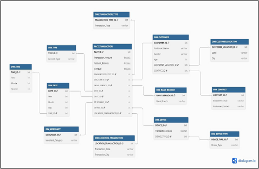
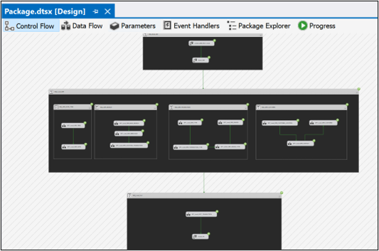
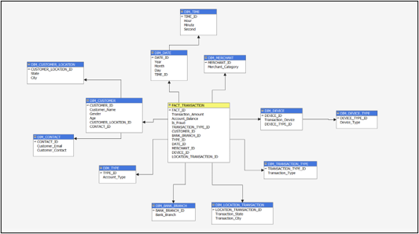
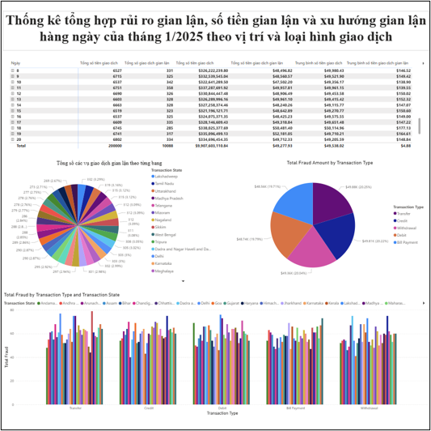
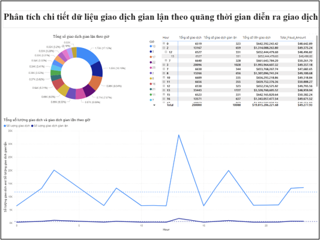
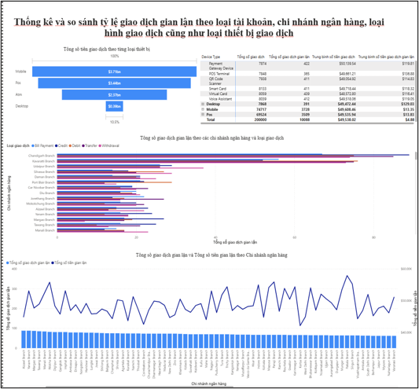

# 🏦 Bank Transaction Fraud Detection Data Warehouse & Predictive System


An end-to-end Data Warehousing, OLAP, and Predictive Machine Learning pipeline built to ingest, clean, transform, model, and classify bank transaction data for operational risk tracking and fraud detection.

---

## 🛠️ Technologies & Tools

* **Data Integration (ETL):** SQL Server Integration Services (SSIS)
* **Analytical Processing (OLAP):** SQL Server Analysis Services (SSAS), MDX Queries
* **Database & Storage:** SQL Server (Data Warehouse)
* **Machine Learning & Modeling:** Python (LightGBM, XGBoost, Pandas, NumPy)
* **Business Intelligence & Visualization:** Power BI

---

## 📊 Dataset Information
* **Source:** [Kaggle Bank Transaction Fraud Detection Dataset](https://www.kaggle.com/datasets/marusagar/bank-transaction-fraud-detection)
* **Volume:** 200K+ transaction records, used for end-to-end processing from ETL to multi-dimensional analysis and machine learning forecasting.

---

## 📐 Data Warehouse Architecture

The Data Warehouse is designed using a **Snowflake Schema** consisting of **1 Fact table** and **11 Dimension tables**. This architecture ensures data normalization and optimized query performance for complex analytical processing.

### Schema Diagram


**Fact Table:**
* `FACT_TRANSACTION`: Stores transactional metrics, fraud flags, and foreign keys to dimensions.

**Key Dimensions:**
* `DIM_CUSTOMER`, `DIM_BANK_BRANCH`, `DIM_CUSTOMER_CONTACT` , `DIM_CUSTOMER_LOCATION`, `DIM_DATE`, `DIM_TIME`, `DIM_LOCATION_TRANSACTION`, `DIM_DEVICE`, `DIM_DEVICE_TYPE`, `DIM_TRANSACTION_TYPE`, `DIM_MERCHANT`.

---

## 🔄 ETL Pipeline (SSIS)

The ETL process extracts raw transaction data, performs rigorous data profiling, cleansing, and transformation, and loads it into the SQL Server Data Warehouse Snowflake Schema.

### ETL Control Flow & Data Flow


**Key ETL Steps:**
1. **Extraction:** Connected to raw flat files of the 200K+ dataset.
2. **Transformation:** Handled missing values, standardized data types, and executed Lookup transformations to map surrogate keys.
3. **Loading:** Populated normal dimensions and facts efficiently into SQL Server.

---

## 🧊 OLAP Cube & Multi-Dimensional Modeling (SSAS)

To facilitate high-speed querying and complex business aggregations, an OLAP Cube was developed using SSAS.

### Cube Structure


* **Measures:** Transaction Amount, Fraud Count, Transaction Frequency.
* **Hierarchies:** Built drill-down hierarchies (e.g., Year -> Quarter -> Month -> Day) for deeper temporal analysis.
* **Querying:** Utilized **MDX Queries** to validate cube integrity.

---

## 📊 Business Intelligence Dashboards (Power BI)

Power BI was directly connected to the **SQL Server Analysis Services (SSAS)** database using the **Connect Live** method. This allows real-time analytical querying against the deployed multi-dimensional OLAP cube. The dashboard consists of 3 specialized report pages, meticulously designed step-by-step to capture fraud patterns:

---

### 1. Report Page 1: Fraud Risk & Transaction Overview
* **File Name:** `Report1.png`
* **Objective:** Summary statistics of fraud risks, stolen amounts, and daily fraud trends for January 2025 broken down by location hierarchies and transaction types.
* **Component Design & Configurations:**
  * **Matrix Grid:** Configured Rows with `Day` and `PhanCapLocationTransaction` hierarchy. Deployed measures into Values including: `Total Transaction`, `Total Fraud`, `Total Transaction Amount`, `Total Fraud Amount`, `Average Transaction Amount`, and `Average Fraud Amount`.
  * **Pie Chart (Distribution by State):** Set Legend to `Transaction State` and Values to `Total Fraud` to visualize spatial distribution of anomalies.
  * **Pie Chart (Distribution by Type):** Set Legend to `Transaction Type` and Values to `Total Amount Fraud` to identify high-value target categories.
  * **Clustered Column Chart:** Mapped `Transaction Type` to the X-axis, `Total Fraud` to the Y-axis, and segmented via `Transaction State` in the Legend.



---

### 2. Report Page 2: Temporal & Time-Series Fraud Analytics
* **File Name:** `Report2.png`
* **Objective:** Deep-dive analysis of fraudulent transaction patterns across detailed temporal intervals and time dimensions.
* **Component Design & Configurations:**
  * **Matrix Grid:** Structured with `PhanCapTime` hierarchy in Rows. Values display `Total Transaction`, `Total Transaction Fraud`, `Total Transaction Amount`, and `Total Fraud Amount`.
  * **Donut Chart (Hourly Breakdown):** Configured `Hour` in the Legend and `Total Transaction Fraud` in Values to track high-risk time windows during the day.
  * **Line Chart (Trend & Velocity Analysis):** Plotted `PhanCapTime` on the X-axis against both `Total Transaction` and `Total Fraud` on the Y-axis. Added **Average Reference Lines** for both metrics to explicitly visualize anomaly spikes above baseline volumes.



---

### 3. Report Page 3: Channel, Branch & Device Comparison Analytics
* **File Name:** `Report3.png`
* **Objective:** Statistical comparison of fraud ratios across user account types, bank branches, transactional channels, and technology hardware profiles.
* **Component Design & Configurations:**
  * **Matrix Grid:** Aggregated operational comparison metrics utilizing dimensions for account types and branch structures.
  * **Funnel Chart (Device Impact):** Configured `Device Type` as the Category and `Transaction Amount` as Values to show financial volumes flowing through hardware platforms.
  * **Clustered Bar Chart:** Segmented fraud metrics horizontally by operational channels and branch locations.
  * **Line and Clustered Column Chart:** Dual-axis chart combining volume distribution bars with ratio trendlines to benchmark transaction types against fraud percentages.



## 🧠 Machine Learning & Data Mining (Python)

An advanced Predictive Analytics engine was built on Kaggle using a **Time-Series Ensemble model (LightGBM & XGBoost)** to identify fraud behaviors and catch emerging anomaly patterns.

### 🏆 Out-Of-Fold (OOF) Evaluation Metrics
```text
==================================================
🏆 KẾT QUẢ ĐÁNH GIÁ CHUNG TOÀN HỆ THỐNG (OUT-OF-FOLD)
==================================================
🌟 Tổng thể OOF AUC: 0.91572
🎯 Ngưỡng cắt F1 tối ưu: 0.2902 (F1-Score cao nhất: 0.5581)

--- BÁO CÁO PHÂN LOẠI CHI TIẾT ---
              precision    recall  f1-score   support

      Hợp lệ       0.98      0.99      0.98    426130
    Gian lận       0.65      0.49      0.56     16775

    accuracy                           0.97    442905
   macro avg       0.81      0.74      0.77    442905
weighted avg       0.97      0.97      0.97    442905